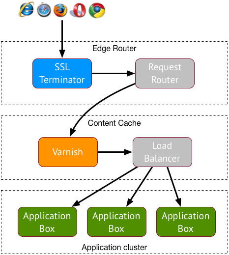
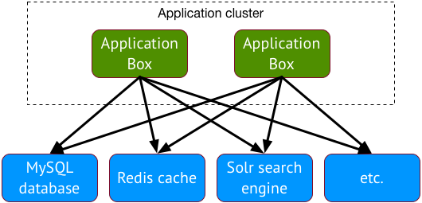

# The Basics

In this Getting Started Guide, we will show you how to launch your first website
on freistilbox. Before we get going, though, let us explain a few things first
that will help you understand what freistilbox does differently to become a
world-class hosting platform for Drupal and WordPress.

## Many pieces working together

With conventional hosting, you usually get webspace on a server that's also used
by other customers ("shared server"), or your own server that you need to
maintain yourself ("dedicated server"), or even one that is maintained by your
provider ("managed server"). **freistilbox is quite a different animal.**

With freistilbox, you don't get just "a server". Our hosting platform is based
on an IT architecture that is called a "distributed system". This means that
your web application is served by a multitude of servers, each one optimised for its
specific purpose. And where ever possible, we've built in redundancy in order to
maximise your website's uptime.

Let's take a detailed look at the different parts of freistilbox. There's much
to discover! The following diagram shows how freistilbox handles web requests
from your website visitors:

First, incoming requests arrive at one of our Edge Routers. The purpose of these
machines is to decrypt incoming SSL traffic and then to pass each request to the
freistilbox cluster running the website to which it is addressed.

Every freistilbox cluster has its own Content Cache based on the Varnish reverse
proxy. Varnish stores content that is requested frequently in RAM, so when this
content gets requested, Varnish will be able to deliver it many times faster
than your web application. Since SSL requests have already been decrypted by the
Edge Router at this stage, Varnish will boost content delivery performance for
both HTTP and HTTPS traffic. If a request can not be answered with cached
content, though, a load balancing algorithm decides to which Application Box it
should be forwarded.

## The box in "freistilbox"

At the heart of the freistilbox hosting platform is what we call "boxes". The
precise term would be "web application servers" but let's be honest — nobody
uses that term outside of technical whitepapers. At a conventional hosting
provider, your website would run on a single server. On the freistilbox
platform, on the other hand, your website's Drupal or WordPress installation might run on
2, 5 or 20 servers! We've built freistilbox so that it will distribute
the load over an arbitrary number of servers, depending on the capacity required
to serve your content reliably. This gives you the flexibility to always get the
capacity you need to satisfy your visitors. And the inherent redundancy reduces
the risk that your websites becomes unavailable if one of the boxes takes a time
out.

## Platform services

Both Drupal and WordPress use a MySQL database for storing content. But that's
not the only service dependency — modern web applications rely on many more
services like Memcache and Apache Solr in order to deliver a great user
experience. 

freistilbox offers you all these services, each running on separate
infrastructure designed for maximum performance and reliability.

## Managed by experts

So now you have an idea of how freistilbox works. If you think that all this
stuff sounds like a hugely complex thing to run, let us assure you: _it is_. :-)
And we've got you covered. freistilbox is a fully managed hosting platform,
which means that our operations team will take care of everything that your web
application needs to run smoothly. Together, we have more than 30,000 hours of
experience in running business-critical web infrastructure. We're using it so
you can work efficiently and sleep peacefully.

If you find this architecture hard to grasp, don't worry. We've made a lot of
effort to keep the complexity under the hood. In a short time, you're going to
find that freistilbox is easier and more efficient to use than the hosting
solutions you've known so far!

---

_Next:_ Let's get started and [set up your first website](website.html)!
