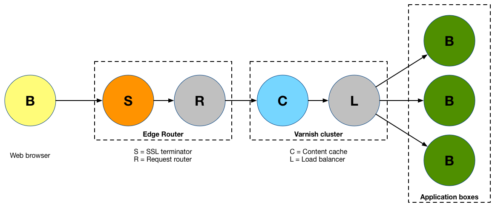

# The Basics

In this Getting Started Guide, we will show you how to launch your first website
on freistilbox. Before we get going, though, let us explain a few things first
that will help you understand what freistilbox does differently to become a
world-class hosting platform for Drupal and WordPress.

## Many pieces working together

With conventional hosting, you usually get webspace on a server that's also used
by other customers ("shared server") or your own server that you need to
maintain yourself ("dedicated server") or that is maintained by your provider
("managed server"). freistilbox is quite a different animal.

With freistilbox, you don't get just "a server". Its architecture is what is
called a "distributed system". Each hosting service runs on separate IT
infrastructure which is optimised for its own specific requirements. Where ever
possible, we've built in redundancy in order to maximise website uptime.

Let's take a detailed look at these components. There's much to discover!

The following diagram shows how freistilbox handles web requests from your
website visitors:

First, incoming requests reach one of our Edge Routers. The purpose of these
machines is to decrypt incoming SSL traffic and then to pass each request to the
freistilbox cluster running the website to which it is addressed.

Every freistilbox cluster has its own Varnish content cache. Since at this stage
SSL requests have already been decrypted by the Edge Router, Varnish will boost
content delivery performance for both HTTP and HTTPS traffic. If a request can
not be answered with cache content, a load balancing algorithm decides to which
Application Box it should be forwarded.

## The box in "freistilbox"

At the heart of the freistilbox hosting platform is what we call "boxes". The
precise term would be "web application servers" but let's be honest — nobody
uses that term outside of technical whitepapers. At a conventional hosting
provider, your website would run on a single server. On the freistilbox
platform, though, your website's Drupal or WordPress installation might run on
2, 5 or more than 10 servers! We've built freistilbox so that it will distribute
the load over an arbitrary number of servers, depending on the capacity required
to serve your content reliably.

## Platform services

Both Drupal and WordPress use a MySQL database for storing content. But that's
not the only dependency on a separate software — modern web applications rely on
many more services like Memcache or Apache Solr in order to deliver a great user
experience. freistilbox offers you all these services, each running on separate
infrastructure designed for maximum performance and reliability.

## Don't panic.

So now you have an idea of how freistilbox works. If you think that all this
stuff sounds like a hugely complex thing to run, let us assure you: it is. :-)
And we've got you covered. freistilbox is a fully managed hosting platform and
that means that our operations team will take care of everything that your web
application needs in order to run smoothly. 

We've made a lot of effort to keep the complexity under the hood and with
time, you'll find that freistilbox is more easy and efficient to use
than the hosting solutions you've known so far!

---

_Next:_ Let's get started and [set up your code repository](repository.html)!
